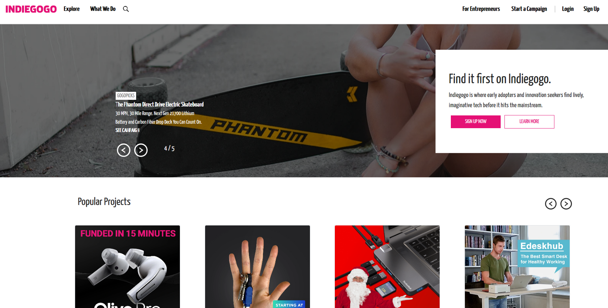

# Indiegogo Clone

  <h4>
  A Crowd Funding Platform for Entreprenuers for fund Raising and Explore different Products available.
    </h4>
 

## Languages and Tools:  

<code></code>
<code></code>
<code></code>
<code></code>
<code></code>
<code></code>

### Project Screenshots
- Landing Page

- Explore Products page

### Installation and Setup Instructions

Clone down this repository. You will need node and npm installed globally on your machine. Installation: npm install To Run Test Suite: npm test To Start Server: npm start To Visit App: localhost:3000/

### Tools Used
- React
- Ant Design
- Bootstrap

## Contributors
 <h3>Chandra Mouli</h3>‍👨 - <a href="https://github.com/Chandramouliva" >Chandra Mouli</a>
<h3>Lakshmi S</h3>👱 -  <a href="https://github.com/Laksh-Koundinya">Lakshmi</a> 
<h3>Vinay Gupta</h3> 👨‍ - <a href="https://github.com/vinaytest75">Vinay</a>

## Acknowledgments

  We take all the responsiblity for every single line of code. 

